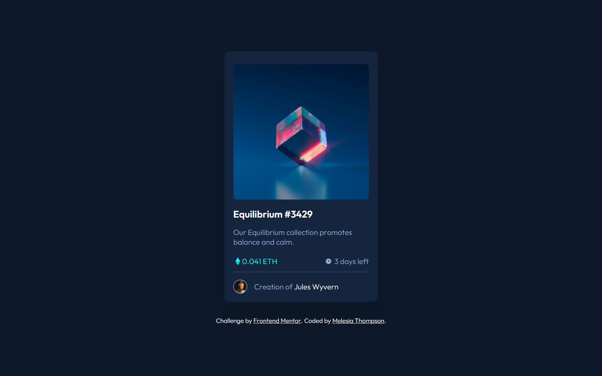
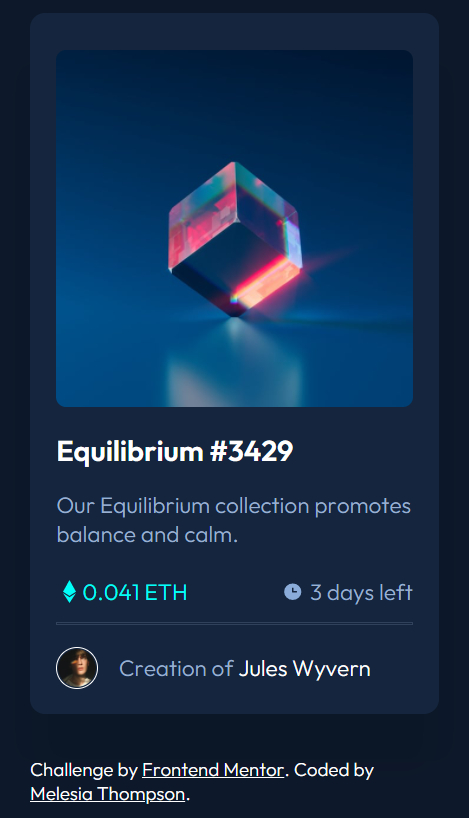
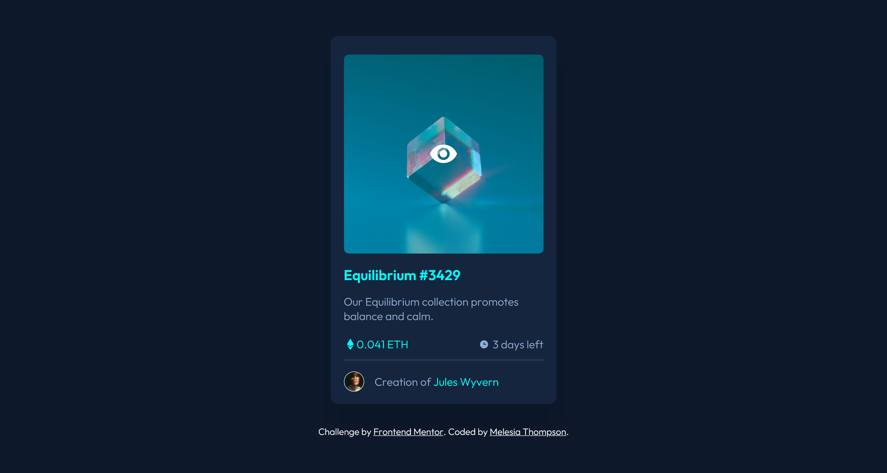

# Frontend Mentor - NFT preview card component solution

This is a solution to the [NFT preview card component challenge on Frontend Mentor](https://www.frontendmentor.io/challenges/nft-preview-card-component-SbdUL_w0U). Frontend Mentor challenges help you improve your coding skills by building realistic projects. 

## Table of contents

- [Overview](#overview)
  - [The challenge](#the-challenge)
  - [Screenshot](#screenshot)
  - [Links](#links)
- [Author](#author)
- [Acknowledgments](#acknowledgments)

## Overview

### The challenge
To build out a preview card component and get it looking as close to the design as possible.
Users should be able to:

- View the optimal layout depending on their device's screen size
- See hover states for interactive elements

### Screenshot

Desktop

Mobile 

Active States

### Links

- Solution URL: [Add solution URL here](https://your-solution-url.com)
- Live Site URL: [Add live site URL here](https://your-live-site-url.com)

## Author

- Website - [Add your name here](https://www.your-site.com)
- Frontend Mentor - [@xhocopuff](https://www.frontendmentor.io/profile/xhocopuff)
- Twitter - [@xhocopuff](https://twitter.com/xhocopuff)

## Acknowledgments

A shout-out to [@sultanofcardio](https://github.com/sultanofcardio) for helping with understanding github and showing me how to use figma for mockups.